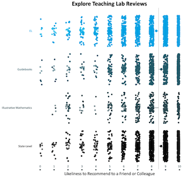

# Active Dashboards (SY20-21)

[{width=195px}](https://teachinglabhq.shinyapps.io/CourseSurvey/)
[{width=195px}](https://teachinglabhq.shinyapps.io/SessionSurvey/)
[{width=195px}](https://teachinglabhq.shinyapps.io/DiagnosticComplete/)
[{width=195px}](https://teachinglabhq.shinyapps.io/RaceandCulture2/)
[{width=195px}](https://teachinglabhq.shinyapps.io/PersonalFacilitator/)

# Inactive Dashboards (Pre SY20-21)

[{width=195px}](https://teachinglabhq.shinyapps.io/ParticipantFeedback/)

# Visualizations

[{width=195px}](https://teachinglab.github.io/TLReviews.html)
