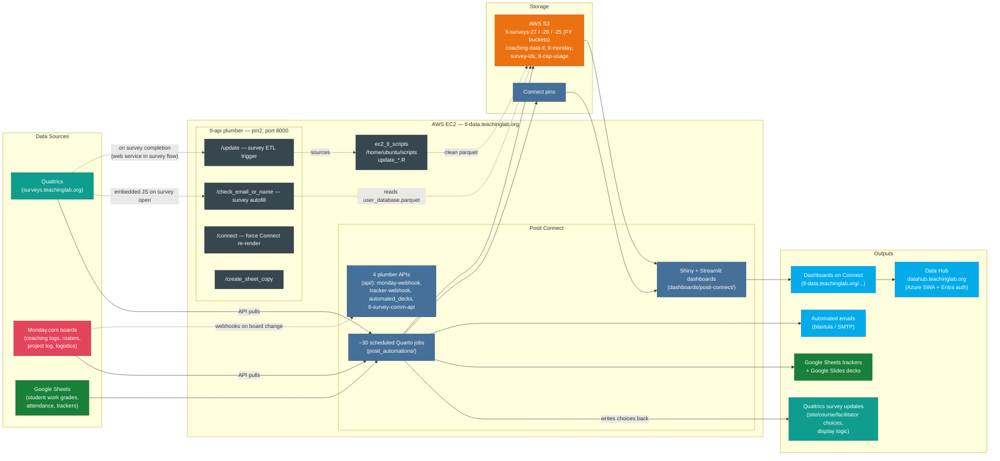
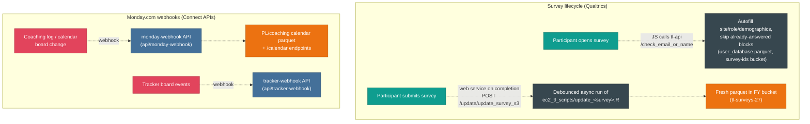
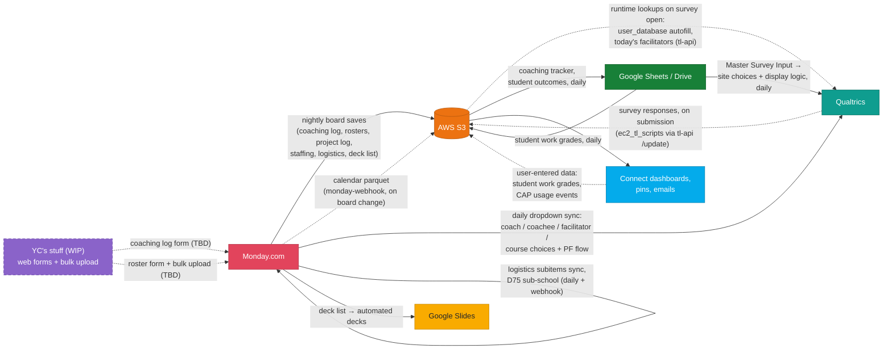
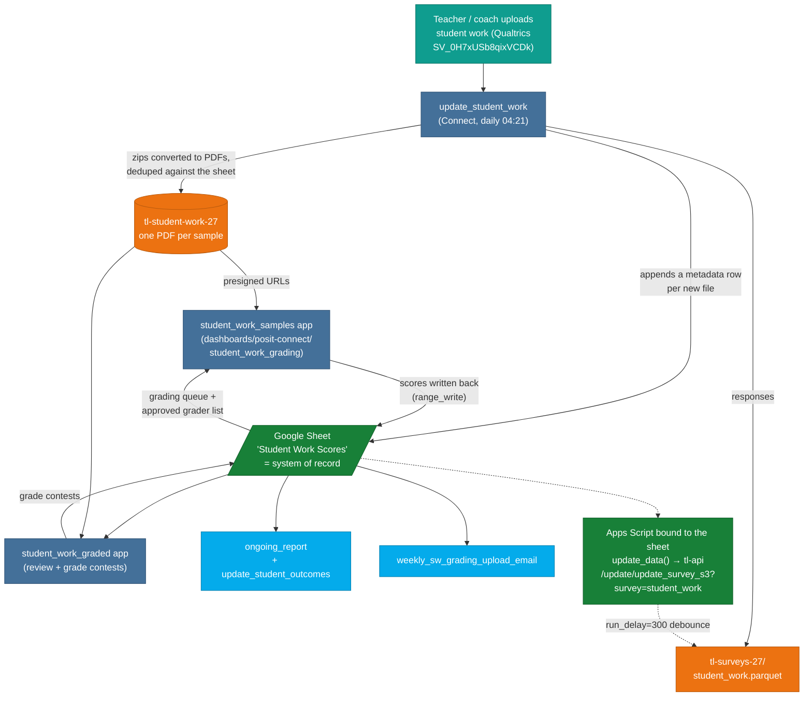

::: {.callout-note appearance="simple"}
This page is generated from `ARCHITECTURE.md` in the TeachingLab package repo and re-synced whenever the Connect inventory refreshes (last sync: 2026-08-11). Edit it there, not here.
:::

Internal (login-required) hosted versions on Posit Connect:

- **Interactive routing map**: <https://tl-data.teachinglab.org/architecture/>
  (source: `dashboards/posit-connect/architecture_map/` — the generator splices
  live inventory JSON into it; redeploy with `rsconnect::deployApp()` after the
  weekly refresh to pick up new data)
- **Stakeholder overview** (non-technical, where data lives / how often it
  updates): <https://tl-data.teachinglab.org/data-overview/>
  (source: `dashboards/posit-connect/data_overview/`)

## System overview

Everything runs on or through one EC2 instance (`tl-data.teachinglab.org`,
3.131.192.25), which hosts Posit Connect and a standalone plumber API managed
by pm2. Three GitHub repos feed it:

| Repo | What it holds | How it deploys |
|---|---|---|
| `dungates/TeachingLab` (the package repo) | R package, scheduled Connect jobs (`posit_automations/`), Connect plumber APIs (`api/`), dashboards | `rsconnect::deploy*` to Posit Connect |
| `dungates/ec2_tl_scripts` | Qualtrics → S3 survey ETL scripts | Lives at `/home/ubuntu/scripts` on the EC2 box |
| `dungates/tl-api` | Standalone plumber API (port 8000) | Lives at `/home/ubuntu/plumber-apis`, run by pm2 (`@reboot pm2 resurrect`) |
| `TeachingLabHQ/teachinglab.github.io` | Data Hub Quarto site | Azure Static Web Apps (Entra ID auth) at datahub.teachinglab.org |

*Solid arrows = scheduled or on-load; dashed = event-driven (webhooks,
survey-flow web services). Node colors: red Monday, teal Qualtrics, green
Google, orange AWS, slate EC2 services, blue Posit Connect / outputs.*

## Event-driven flows

Three kinds of triggers exist besides the Connect schedules — Qualtrics survey
flows, Monday webhooks, and Google Apps Scripts bound to sheets. The first two
are diagrammed below; the third is covered under
[Student work](#student-work-a-google-sheet-as-the-backend), which is the case
we know about.

Notes:

- `run_all_files.r` in `ec2_tl_scripts` batch-runs every non-archived
  `update_*.R`; there is **no crontab entry** for it on the box — survey ETL is
  event-driven via the plumber `/update` endpoint (plus manual batch runs).
- The tl-api plumber also exposes `/connect/schedule_posit_script`, which lets a
  Qualtrics flow (or anything else) force an immediate re-render of a Connect
  job by GUID.
- Scheduled Connect jobs write *back* to Qualtrics too: site/course/facilitator
  choice lists and display logic are updated daily from Monday data.
- The tl-api plumber is reachable publicly at `https://api.teachinglab.org`, not
  only from the box — that is what lets Qualtrics survey flows and Google Apps
  Scripts call it. Callers authenticate with a static shared secret in an
  `Authorization` header. **Google Apps Scripts are the least discoverable
  trigger in the whole system**: they live inside individual Google Sheets, not
  in any repo, so nothing here shows them and grep will never find them. If a
  dataset refreshes at a time no Connect schedule explains, look for a bound
  script before anything else.

## Cross-system data routing

How data moves *between* platforms — including the write-backs, which are the
easy ones to forget. S3 is the hub: almost everything lands there as parquet
before going anywhere else, and two S3 objects get read back into Qualtrics at
survey runtime.

*Solid arrows = scheduled; dashed = event-driven or on-use (webhooks, survey
runtime, user input). An interactive version of this map — hover to trace a
system's routes, click an edge for the jobs behind it — is published
alongside this doc.*

Route detail:

| Route | What moves | Jobs / mechanisms | Cadence |
|---|---|---|---|
| Qualtrics → S3 | Survey responses → cleaned parquet in the FY bucket (`tl-surveys-27`) | `ec2_tl_scripts/update_<survey>.R`, triggered by the completion web service in each survey flow (tl-api `/update`) | Minutes after each submission |
| Monday → S3 | Coaching log, coach roster, project log, staffing match, facilitator board, logistics lookups, deck list, misc boards → `tl-monday` / `coaching-data-tl` | `update_coaching_log_27`, `update_coaching_roster_27`, `update_project_log`, `employee_info`, `update_fac_board`, `save_various_monday_boards`, `update_fac_course_list_daily_fy27`, `update_deck_list` | Nightly |
| Monday → S3 (event) | PL/coaching calendar parquet | `monday-webhook` Connect API (+ daily rebuild) | On board change |
| Monday → Qualtrics | Survey dropdowns and logic: coach, teacher/coachee, facilitator, and course choices; participant feedback survey flow | `update_coach_selection`, `update_coachee_selection_27`, `update_facilitator_choices`, `update_course_choices`, `update_pf_flow` | Daily |
| Google Sheets → Qualtrics | Master Survey Input workbook → site/subsite choices and display logic across surveys | `update_site_choices` | Daily |
| Qualtrics → S3 (files) | Student work PDFs uploaded by teachers → `tl-student-work-27`, plus a metadata row per file in the grading sheet | `update_student_work` | Daily |
| Google Sheets → S3 | Student work grades → parquet | `update_student_work` | Daily |
| S3 → Google Sheets | Coaching tracker completion status; student outcomes | `tracker_27`, `update_student_outcomes(_2)` | Daily |
| S3 → Qualtrics (runtime) | `survey-ids/user_database.parquet` (autofill + skip logic) and `tl-monday/pl_today_facilitators_fy27.rds` (today's facilitator list), read when a participant opens a survey | tl-api `/check_email_or_name`, `/facilitators_coaches`, called from survey-embedded JS | On survey open |
| Monday → Monday | Coaching log entries → logistics board subitems; D75 sub-school routing | `monday_subitems_logistics` (daily), `monday-webhook` (event) | Daily + webhook |
| Monday → Google Slides | Deck list board → generated slide decks | `update_deck_list` + `automated_decks` Connect API | Daily / on demand |
| S3 → serving | Everything above feeds Connect dashboards, pins, reports, and emails | Connect apps and scheduled jobs | On load / per schedule |
| Serving → S3 | User-entered data flowing back: student work grading inputs, CAP usage events (rolled up weekly/monthly) | Grading apps, CAP dashboard, `update_cap_usage_weekly/monthly` | On use |
| YC's stuff → Monday *(WIP)* | Planned: web forms for coaching log and coaching roster entry, plus a bulk upload feeding the roster — details deliberately TBD for now | TBD | On submit / on upload |

## S3 buckets

S3 is the hub, so it is worth knowing which bucket holds what. Fiscal-year
buckets are the trap: a job pinned to `tl-surveys-27` sees nothing from SY25-26,
and a "fall back to last year's bucket" pattern silently drops the prior year
once the current-year object appears. Bind both years rather than falling back.

| Bucket | Holds | Written by | Read by |
|---|---|---|---|
| `tl-surveys-27` (also `-26`, `-25`, and the unsuffixed `tl-surveys`) | Cleaned survey parquet, one object per survey per fiscal year | `ec2_tl_scripts/update_<survey>.R`, `update_student_work` | Nearly every dashboard, report, and email |
| `tl-monday` | Monday board saves: coaching log, rosters, facilitator board, staffing, logistics lookups, deck list, today's facilitators | `update_coaching_log_27`, `update_coaching_roster_27`, `save_various_monday_boards`, `update_fac_board`, `update_fac_course_list_daily_fy27`, `update_deck_list` | Dashboards, trackers, the Qualtrics choice-list jobs, tl-api |
| `coaching-data-tl` | Coaching-specific derived data (CAPs, coaching outcomes, calendar parquet) | Coaching jobs, `monday-webhook` | Coaching dashboards, `/calendar` endpoints |
| `tl-student-work-27` | The actual student work PDFs, one object per uploaded sample | `update_student_work` | `student_work_samples` and `student_work_graded` apps |
| `survey-ids` | `user_database.parquet` — the participant lookup Qualtrics reads at survey open | `ec2_tl_scripts` | tl-api `/check_email_or_name` |
| `tl-shiny-cap-usage-2` | CAP usage events plus weekly and monthly rollups | CAP dashboard, `update_cap_usage_weekly/monthly` | CAP usage dashboard |
| `tl-file-upload`, `tl-miscellaneous`, `tl-daily-stats`, `tl-capacity-plots`, `course-assessments-raw` | Supporting odds and ends: uploaded files, backups, cached stats and plots, raw assessment exports | `tl_file_upload`, `Daily Data Backup`, assorted jobs | The apps that produced them |

## Student work: a Google Sheet as the backend

Student work grading is the one pipeline that does not follow the usual
"source → S3 → dashboard" shape. A Google Sheet
(`1snMytJMFiuiVj7F167jfrLq-WSFOTKD0cOD40WtTSgY`, tab *Student Work Scores*) is
the actual system of record for grades, and the PDFs live in S3 alongside it.
Nothing about that arrangement is inferable from the Connect inventory, which is
why it gets its own section.

Things to know before touching it:

- **There is a Google Apps Script in the loop.** A script bound to the grading
  sheet (`update_data()`) POSTs to the tl-api plumber at
  `https://api.teachinglab.org/update/update_survey_s3?survey=student_work&run_delay=300`,
  which re-runs the `ec2_tl_scripts` survey ETL for student work with a
  five-minute debounce. It authenticates with a static shared secret in an
  `Authorization` header, hardcoded in the script. So the student work parquet
  refreshes on sheet activity as well as on the daily Connect job — if data looks
  stale, check the Apps Script's execution log in the sheet
  (Extensions → Apps Script → Executions), not just the Connect job history.

- **The sheet is the write target, not a cache.** Both grading apps write scores
  back into it with `googlesheets4::range_write()` at fixed ranges, so inserting
  or reordering columns breaks grading silently.
- **Deduplication happens against the sheet**, not against S3: the daily job
  reads existing rows and only uploads files it does not already see there.
- **Bucket, sheet, and survey are all fiscal-year scoped.** Rolling to a new
  year means a new `tl-student-work-<FY>` bucket, a fresh copy of the grading
  sheet, and a new Qualtrics survey ID — four hardcoded places in total.
- Zip uploads are renamed to `.pdf` wholesale by the daily job; anything that is
  genuinely a zip of several samples will not render in the grading app.

## Operational monitoring

The published inventory below is a *design-time* view: what exists and when it
is supposed to run. The runtime view lives in the **Connect Infrastructure
Monitor** (`posit_automations/monitor_connect_scripts.qmd`, published at
<https://tl-data.teachinglab.org/monitor_connect_scripts/>, itself a daily
scheduled job). It queries the Connect API for every static-rendered script and
shows last run time, success rate, run duration trends, and anything overdue by
more than 15 minutes.

The two views deliberately cover different sets:

| | This document | Connect Monitor |
|---|---|---|
| Scheduled Quarto/R Markdown jobs | ✅ the 30 active ones, with cadence and repo path | ✅ all of them, with health and timing |
| Deployed-but-unscheduled static content | ❌ omitted | ✅ shown (with no next run) |
| Plumber APIs, Shiny/Streamlit apps | ✅ listed with repo paths | ❌ out of scope (static content only) |
| Data flows, buckets, write-backs, event triggers | ✅ | ❌ |
| Per-analyst PDS goal pages | ❌ | ❌ filtered out by name (`_pds_`) |

As of the latest inventory refresh the server holds **199 static-rendered
content items, only 30 of which are scheduled**. The other ~169 are one-off
analysis renders, superseded FY26 jobs left in place after their FY27 successors
shipped (`update_coaching_log_26`, `update_coaching_roster_26`,
`update_coachee_selection`, `tracker_26`, `validate_roster_26`, `update_caps_26`),
and ~130 per-analyst FY25 PDS goal pages. They cost nothing to leave deployed,
but they make the Connect content list hard to read — a periodic sweep is worth
scheduling.

## CI/CD (GitHub Actions in the package repo)

| Workflow | Trigger | What it does |
|---|---|---|
| `render-posit-automations-index.yml` | push to `posit_automations/` | Regenerates `posit_automations/INDEX.md` |
| `update-architecture.yml` | weekly + manual | Regenerates the inventory below from the Connect API, then syncs this file to the Data Hub as `architecture.qmd`, renders it, and pushes so Azure redeploys |
| `pkgdown.yaml` | push | Builds package docs (datadocs.teachinglab.org) |
| `rsync-deploy.yml` | push | Rsyncs `dashboards/shiny-server/` to the old Shiny Server — **server is retired; workflow and `dashboards/shiny-server/` are safe to delete** |
| `run_daily_scripts.yml` | — | Fully commented out (SY23-24 era) |

## Known loose ends (as of 2026-08-06)

- **Old Shiny Server is retired** (confirmed 2026-08-06): all dashboards now
  live on Posit Connect. Cleanup still pending: delete `rsync-deploy.yml`
  (it rsyncs `dashboards/shiny-server/` to the dead server on every push) and
  archive `dashboards/shiny-server/`.
- **Two other EC2 hosts** exist in `~/.ssh/config` (3.17.162.157, 13.59.10.1) —
  presumably the retired Shiny Server era instances; worth terminating if
  they're still running (check the AWS console for billing).
- `update_coachee_selection` (FY26) had a live daily schedule running alongside
  the FY27 replacement for months, emailing analysts unfixable roster warnings
  off the stale FY26 roster. Schedule 171 (variant 179) was **deleted 2026-08-08**;
  the content itself is left in place, unscheduled. Note the schedule record's
  `activate: FALSE` meant "don't activate the rendered output", *not* "disabled" —
  don't read that flag as an off switch. Schedules are owned by
  `/__api__/schedules/{id}`; `/__api__/variants/{id}/schedules` is a read-only
  collection view and 404s on DELETE.
- **`update-architecture.yml` has never completed successfully.** Its first
  scheduled run (2026-08-10) died on `CONNECT_API_KEY is not set` — the secret
  does not exist on the repo. The Data Hub sync step additionally needs a
  `DATAHUB_PUSH_TOKEN` with write access to `teachinglab/teachinglab.github.io`.
  Until both secrets are added, the inventory below and the published Data Hub
  page only refresh when someone runs the scripts by hand.
- **Apps Scripts are undocumented infrastructure.** At least one sheet-bound
  script (the student work grading sheet) calls tl-api on a schedule of its own,
  with the shared secret hardcoded in the script body. Worth auditing the other
  operational sheets for bound scripts, moving the secret into Script Properties,
  and listing whatever is found here — right now the only record of them is
  whoever remembers writing them.
- Older Connect apps (`ongoing_report_24_25`, `TeachingLLM`, `nps_monitoring_tl`,
  `tl_scrollytell`) have not been deployed in 6+ months and are likely inactive.
- One *active* daily schedule still runs from a source in
  `posit_automations/deprecated/`: `daily_percent_completion` (00:30). Either
  un-deprecate the source or retire the schedule. (`Coach/Facilitator Board
  Save` was the other one; its source has since moved to `data_updates/`.)

## Live Connect inventory

<!-- BEGIN GENERATED: connect-inventory -->

_Auto-generated from the Posit Connect API on 2026-08-11 02:31 EDT by `data_scripts/generate_architecture.R`. Do not edit this section by hand._

**Connect server:** https://tl-data.teachinglab.org/ — 265 content items, 30 active schedules, 4 APIs, 29 interactive apps.

### Active scheduled jobs (30)

|Job                                              |Cadence         |Run Time (ET) |Source in Repo                 |
|:------------------------------------------------|:---------------|:-------------|:------------------------------|
|Coach/Facilitator Board Save                     |Daily           |01:00         |posit_automations/data_updates |
|Employee Information                             |Daily           |00:00         |posit_automations/data_updates |
|Monitor Connect Scripts                          |Daily           |12:24         |posit_automations              |
|Qualtrics Checks                                 |Daily           |01:00         |posit_automations/validation   |
|Score Course Assessments (FY27)                  |Daily           |09:51         |posit_automations/data_updates |
|Staffing Dashboard Targets Workflow              |Daily           |01:00         |posit_automations/cap_targets  |
|Update Project Log                               |Daily           |00:30         |posit_automations/data_updates |
|Update Qualtrics Survey Teacher Selection (FY27) |Daily           |03:54         |posit_automations/data_updates |
|daily_percent_completion                         |Daily           |00:30         |posit_automations/deprecated   |
|save_various_monday_boards                       |Daily           |05:58         |posit_automations/data_updates |
|tl_file_upload                                   |Daily           |19:00         |posit_automations/emails       |
|update_coach_selection                           |Daily           |04:54         |posit_automations/data_updates |
|update_coaching_roster_27                        |Daily           |00:30         |posit_automations/data_updates |
|update_course_choices                            |Daily           |07:00         |posit_automations/data_updates |
|update_deck_list                                 |Daily           |02:00         |posit_automations/data_updates |
|update_fac_course_list_daily_fy27                |Daily           |06:00         |posit_automations/data_updates |
|update_facilitator_choices                       |Daily           |07:00         |posit_automations/data_updates |
|update_pf_flow                                   |Daily           |07:00         |posit_automations/data_updates |
|update_site_choices                              |Daily           |06:30         |posit_automations/data_updates |
|update_student_outcomes                          |Daily           |02:46         |posit_automations/data_updates |
|update_student_work                              |Daily           |04:21         |posit_automations/data_updates |
|update_cap_usage_monthly                         |Monthly (day 3) |06:00         |posit_automations/data_updates |
|automated_biweekly_reports                       |Twice monthly   |02:38         |*(not in this repo)*           |
|Daily Data Backup                                |Weekdays        |14:00         |posit_automations/data_updates |
|FacT Tier Progression Monitoring                 |Weekdays        |04:00         |*(not in this repo)*           |
|generate_daily_reports                           |Weekdays        |03:58         |*(not in this repo)*           |
|sarah_tierney_custom_design_loops                |Weekly (Mon)    |01:10         |posit_automations/misc         |
|update_cap_usage_weekly                          |Weekly (Mon)    |06:00         |posit_automations/data_updates |
|managers_automated_weekly_project_log_emails     |Weekly (Thu)    |05:00         |posit_automations/emails       |
|project_manager_leads_automated_staffing_emails  |Weekly (Thu)    |05:05         |posit_automations/emails       |

### Deployed APIs on Connect

|API                |Last Deployed |Source in Repo         |
|:------------------|:-------------|:----------------------|
|monday-webhook     |2026-08-03    |api/monday-webhook     |
|automated_decks    |2026-06-10    |api/automated_decks    |
|tracker-webhook    |2026-02-10    |api/tracker-webhook    |
|tl-survey-comm-api |2025-10-15    |api/tl-survey-comm-api |

### Interactive apps on Connect

Apps not deployed recently may be inactive — check before assuming they are live.

|App                      |Framework        |Last Deployed |Source in Repo                                    |
|:------------------------|:----------------|:-------------|:-------------------------------------------------|
|Teaching Lab API Monitor |shiny            |2026-08-07    |dashboards/posit-connect/api_monitor              |
|participant_feedback     |shiny            |2026-08-07    |dashboards/posit-connect/participant_feedback     |
|ongoing_report           |shiny            |2026-08-06    |dashboards/posit-connect/ongoing_report           |
|tl_individual_feedback   |shiny            |2026-08-05    |dashboards/posit-connect/tl_individual_feedback   |
|course_assessments       |shiny            |2026-08-05    |dashboards/deprecated/course_assessments          |
|ongoing_report_sidebot   |shiny            |2026-08-04    |dashboards/posit-connect/ongoing_report_sidebot   |
|calendar_refresh_monitor |shiny            |2026-08-03    |dashboards/posit-connect/calendar_refresh_monitor |
|tl_pl_calendar           |shiny            |2026-08-03    |dashboards/posit-connect/tl_pl_calendar           |
|cap_usage_dashboard      |python-streamlit |2026-07-24    |*(not in this repo)*                              |
|d9_d11_coaching_outcomes |shiny            |2026-07-24    |dashboards/posit-connect/d9_d11_coaching_outcomes |
|project_log_tl           |shiny            |2026-07-22    |dashboards/posit-connect/project_log_tl           |
|coaching_action_plans_v2 |shiny            |2026-07-14    |dashboards/posit-connect/coaching_action_plans_v2 |
|student_work_samples     |shiny            |2026-07-03    |dashboards/posit-connect/student_work_grading     |
|project_log_report_2     |quarto-shiny     |2026-05-19    |posit_automations/reports                         |
|guskey_app               |shiny            |2026-05-11    |*(not in this repo)*                              |
|IPGRawDataDashboard      |shiny            |2026-04-13    |dashboards/posit-connect/ipg_raw_reports          |
|student_work_graded      |shiny            |2026-04-02    |dashboards/posit-connect/student_work_graded      |
|plumber-logging          |shiny            |2026-03-13    |dashboards/posit-connect/plumber-logging          |
|cap_validation           |shiny            |2026-03-11    |dashboards/posit-connect/cap_validation           |
|file-upload-tl           |shiny            |2026-02-17    |dashboards/posit-connect/file-upload-tl           |
|tl_coteach               |python-streamlit |2026-02-02    |*(not in this repo)*                              |
|ongoing_report_24_25     |shiny            |2026-01-05    |dashboards/posit-connect/ongoing_report_24_25     |
|generate_slide_deck      |shiny            |2025-11-30    |dashboards/posit-connect/generate_slide_deck      |
|cap_survey               |shiny            |2025-11-24    |*(not in this repo)*                              |
|coaching_action_plans    |shiny            |2025-11-03    |analysis/sy25_26/coaching_action_plans            |
|cap_naming_validator     |shiny            |2025-10-16    |dashboards/posit-connect/cap_naming_validator     |
|tl_scrollytell           |shiny            |2025-08-07    |*(not in this repo)*                              |
|TeachingLLM              |shiny            |2024-06-04    |*(not in this repo)*                              |
|nps_monitoring_tl        |shiny            |2024-06-03    |*(not in this repo)*                              |

### Disabled schedules still on the server

None.

<!-- END GENERATED: connect-inventory -->
